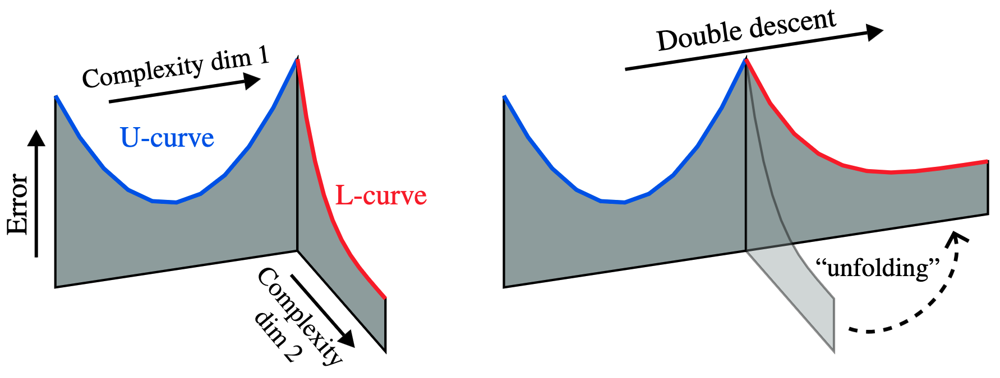

## A U-turn on Double Descent: Rethinking Parameter Counting in Statistical Learning

[](https://openreview.net/forum?id=O0Lz8XZT2b)

This repository contains the code associated with [our NeurIPS 2023 paper](https://openreview.net/forum?id=n6H86gW8u0d) where we demonstrate that the double descent shape observed in recent studies of non-deep ML methods is a direct consequence of the x-axes used to present it resulting in a resolution to the tension between statistical intuition and double descent. For further details, please see our paper.

### Experiments
**Setup**

Clone this repository and navigate to the root folder.
```
git clone https://github.com/alanjeffares/not-double-descent.git
cd not-double-descent
```
Ensure PYTHONPATH is also set to the root folder.
```
export PYTHONPATH="/your/path/to/not-double-descent"
```
Using conda, create and activate a new environment. 
```
conda create -n <environment name> pip python
conda activate <environment name>
```
Then install the repository requirements.
```
pip install -r requirements.txt
```
Finally, set desired paths to data and results folders in `src/config.json`.

Then the three settings of experiments (trees, gradient boosting, and RFF regression) can be run using their respective instructions.

**Trees**

To run the decomposition double descent experiment use the following command.
```
python src/trees/main_trees.py
```
To run the effective parameter experiment use the following command.
```
python src/trees/eff_p_trees.py
```


**Boosting**

To run the decomposition double descent experiment use the following command.
```
python src/trees/main_boost.py
```
To run the effective parameter experiment use the following command.
```
python src/trees/eff_p_boosting.py
```

**RFF Regression**
For a given `<dataset>` (MNIST, CIFAR-10, or SVHN) the RFF experiements can be run using the following command.
```
python src/RFF_linear_regression/main.py --dataset <dataset>
```


### Citation
If you use this code, please cite the associated paper.
```
@inproceedings{
    curth2023a,
    title={A U-turn on Double Descent: Rethinking Parameter Counting in Statistical Learning},
    author={Alicia Curth and Alan Jeffares and Mihaela van der Schaar},
    booktitle={Thirty-seventh Conference on Neural Information Processing Systems},
    year={2023},
    url={https://openreview.net/forum?id=O0Lz8XZT2b}
    }
```

